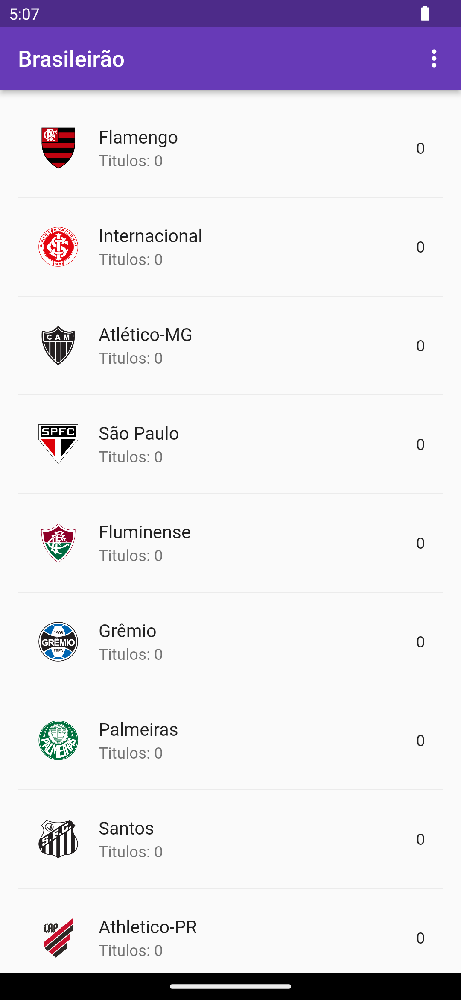
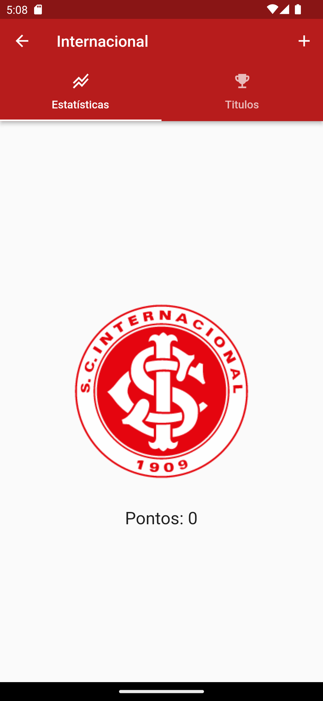
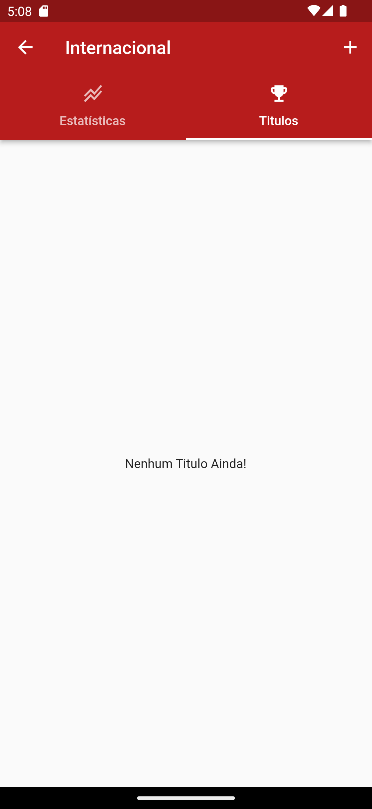

# flutter_football

## commands

    flutter create --project-name flutter_football --platforms windows,android,web ./flutter-football

## packages

    provider
    getx
    shared_preferences
    sqflite

## Screens

    
    
    
    
    

